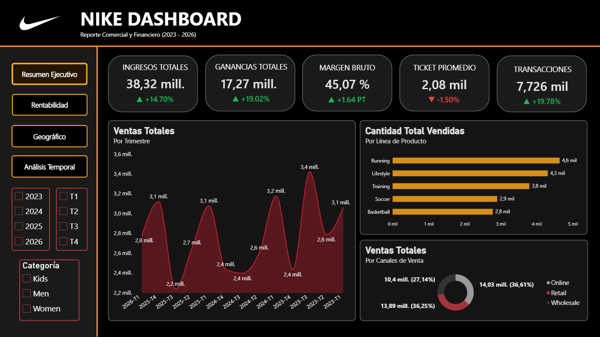
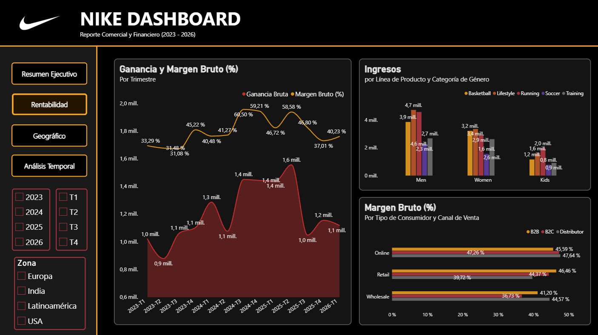
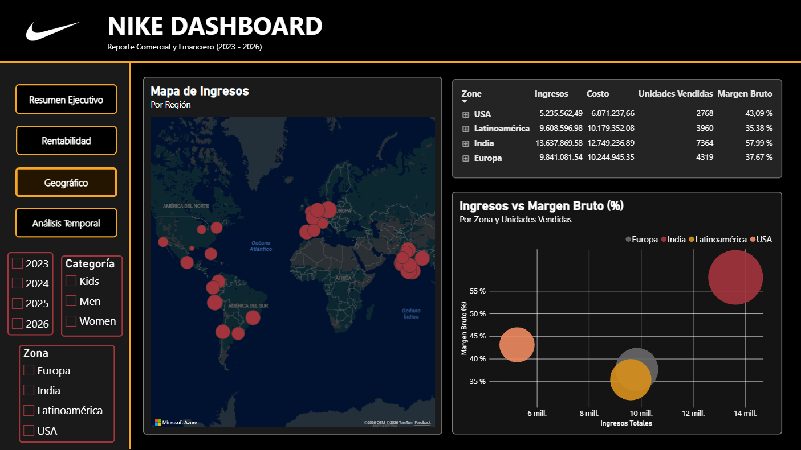
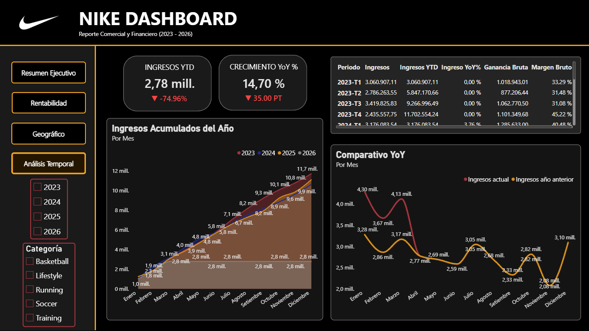

<div align="center">


# Nike Sales Dashboard
### Power BI · Análisis Comercial y Financiero 2023–2026


</div>

---

> Proyecto de Business Intelligence end-to-end sobre un dataset sintético de ventas de Nike.  
> Cubre desde la limpieza de datos en Power Query hasta un dashboard interactivo de cuatro páginas  
> con modelo dimensional en estrella, medidas DAX con inteligencia de tiempo y navegación entre páginas.

---

## 👤 Autor

**Erick Rodrigo Salcca Solorzano**  
Estudiante de Economía — Área de interés: Planeamiento Financiero · Control de Gestión · Planeamiento Comercial

---

## 🗂️ Estructura del repositorio

```
Nike-Sales-Dashboard-PowerBI/
│
├── 📁 Dataset/
│   ├── Nike_Sales_Expanded.csv       ← dataset sintético ampliado (raw)
│   └── Nike_Sales_Cleaned.csv        ← dataset limpio tras el ETL
│
├── 📁 Dashboard/
│   └── NIKE_DASHBOARD.pbix
│
├── 📁 Imagenes/
│   ├── Resumen_Ejecutivo.png
│   ├── Rentabilidad.png
│   ├── Geografico.png
│   └── Analisis_Temporal.png
│
└── README.md
```

---

## 🎯 Caso de negocio

Nike genera miles de transacciones de venta en múltiples canales, regiones y líneas de producto.  
El área comercial necesita una vista única que responda preguntas de gestión sin depender de extracciones manuales.

**Preguntas que responde el dashboard:**

| # | Pregunta |
|---|---|
| 1 | ¿Cuánto se vendió y cuánto se ganó, comparado con el año anterior? |
| 2 | ¿Qué línea de producto y qué zona concentran el margen? |
| 3 | ¿Cómo evoluciona el ingreso acumulado (YTD) año a año? |
| 4 | ¿En qué meses hubo caída respecto al mes anterior (MoM)? |
| 5 | ¿Qué canal de ventas genera mayor rentabilidad? |
| 6 | ¿Qué vendedor cumple mejor su cuota y cuál necesita seguimiento? |

---

## 📦 Origen de los datos

| Ítem | Detalle |
|---|---|
| Dataset base | Nike Sales Uncleaned — Kaggle |
| Tipo | Datos sintéticos de transacciones minoristas y online |
| Registros originales | 2,500 filas · 13 columnas |
| Registros expandidos | 8,000 filas · 20 columnas |
| Rango temporal | Enero 2023 — Marzo 2026 |
| Regiones | 28 ciudades en India, Latinoamérica, Europa y USA |

El dataset fue ampliado con Python para agregar cobertura geográfica internacional, nuevas columnas de análisis financiero y errores intencionales de calidad de datos para practicar la limpieza en Power Query.

**Columnas del dataset expandido:**

<details>
<summary>Ver diccionario de datos completo</summary>

| Columna | Descripción | Problemas intencionales |
|---|---|---|
| `Order_ID` | Identificador de transacción | Duplicados (~3%) |
| `Gender_Category` | Segmento del producto: Men, Women, Kids | — |
| `Product_Line` | Familia: Running, Basketball, Lifestyle, Training, Soccer | — |
| `Product_Name` | Modelo específico vendido | — |
| `Talla` | Talla del producto | Nulos, formatos mixtos (numérico y alfabético) |
| `Units_Sold` | Unidades vendidas | Negativos, nulos |
| `MRP` | Precio de lista antes del descuento | Nulos, ceros |
| `Discount_Applied` | Descuento en decimales | Valores > 1.0 (>100%) |
| `Revenue` | Ingreso final después del descuento | Negativos, mal calculados |
| `Order_Date` | Fecha de transacción | 5 formatos distintos mezclados, nulos |
| `Sales_Channel` | Online / Retail / Wholesale | — |
| `Region` | Ciudad de venta | 69 variantes para 28 ciudades (typos, mayúsculas) |
| `Profit` | Ganancia obtenida | Negativos válidos |
| `Customer_Type` | B2C / B2B / Distributor | Nulos |
| `Seller_ID` | Código de vendedor | Dos formatos distintos (VEN-XXX y VNDxx), nulos |
| `Unit_Cost` | Costo unitario del producto | Nulos masivos (datos históricos) |
| `Sales_Budget` | Presupuesto de ventas por transacción | Nulos masivos |
| `Payment_Method` | Medio de pago | Nulos |
| `Return_Flag` | No / Sí / Pendiente | Nulos |
| `Customer_Satisfaction` | Calificación 1–5 | Valores fuera de rango (10–99), nulos |

</details>

---

## ⚙️ Proceso ETL — Power Query

### Problemas encontrados y decisiones tomadas

| Problema | Columna afectada | Decisión |
|---|---|---|
| 5 formatos de fecha distintos | `Order_Date` | Parseo condicional por patrón con `try...otherwise null` |
| Fechas imposibles (mes 57, día 30 en nov) | `Order_Date` | Convertidas a null — no recuperables |
| Valores negativos en unidades | `Units_Sold` | Convertidos a positivo (error de captura) |
| Revenue negativo | `Revenue` | Flagueado con columna `Revenue_Flag` |
| Descuentos > 100% | `Discount_Applied` | Convertidos a null |
| 69 variantes para 28 ciudades | `Region` | Tabla de mapeo con `Record.FieldOrDefault` |
| Dos formatos de Seller_ID | `Seller_ID` | Estandarizados a `VEN-XXX` |
| Valores fuera de rango 1–5 | `Customer_Satisfaction` | Convertidos a null con columna condicional |
| Duplicados en Order_ID | `Order_ID` | Eliminados (274 filas) conservando primera ocurrencia |
| Nulos en columnas categóricas | `Customer_Type`, `Payment_Method`, `Return_Flag` | Reemplazados por `"Sin registrar"` / `"Sin dato"` |

### Columnas derivadas creadas en Power Query

| Columna nueva | Lógica | Propósito |
|---|---|---|
| `Revenue_Flag` | Condicional sobre Revenue | Identificar transacciones negativas o en cero |
| `Zone` | Mapeo de Region a zona geográfica | Nivel de agrupación superior a ciudad |
| `Año`, `Mes_Número`, `Mes_Nombre` | Extraídas de `Order_Date` limpia | Columnas de tiempo para el modelo |
| `Trimestre`, `Semana` | Derivadas de `Order_Date` | Granularidad temporal adicional |

> **Criterio clave:** nulo y cero no significan lo mismo. Nulo significa dato desconocido; cero significa que ocurrió y fue cero. Tratarlos igual destruye promedios y denominadores en DAX.

---

## ⭐ Modelo de datos — Esquema en estrella

```
                      Dim_Tiempo
                          │
  Dim_Cliente ──── Tabla_Hechos ──── Dim_Producto
                          │
              Dim_Ubicación     Dim_Vendedor
                          │
                    Dim_Transacción
```

| Tabla | Tipo | Campos principales |
|---|---|---|
| `Tabla_Hechos` | Hechos | Revenue, Units_Sold, Profit, MRP, Discount_Applied, Sales_Budget, Unit_Cost, Customer_Satisfaction, Talla |
| `Dim_Tiempo` | Dimensión de tiempo | Fecha, Año, Mes, Trimestre, AñoTrimestre, AñoMes, DíaSemana, EsFinDeSemana, NúmeroSemana |
| `Dim_Producto` | Dimensión | Product_Line, Product_Name, Gender_Category |
| `Dim_Ubicación` | Dimensión | Region, Zone |
| `Dim_Cliente` | Dimensión | Customer_Type, Sales_Channel |
| `Dim_Vendedor` | Dimensión | Seller_ID |
| `Dim_Transacción` | Dimensión | Payment_Method, Return_Flag |

**Granularidad:** un registro = una transacción de venta.  
**Dirección de filtro:** de dimensiones hacia tabla de hechos (uno a muchos, filtro simple).  
**Tabla calendario:** continua desde el 01/01/2023 al 31/12/2026, marcada como tabla de fechas en DAX.

---

## 📐 Medidas DAX

Todas las medidas están organizadas en una tabla vacía `_Medidas` separada de la tabla de hechos.

### Métricas base

```dax
Ingresos Totales = SUM(Tabla_Hechos[Revenue])

Ganancia Total = SUM(Tabla_Hechos[Profit])

Unidades Vendidas = SUM(Tabla_Hechos[Units_Sold])

Num Transacciones = COUNTROWS(Tabla_Hechos)

Ticket Promedio = DIVIDE([Ingresos Totales], [Num Transacciones], 0)

Margen Bruto % = DIVIDE([Ganancia Total], [Ingresos Totales], 0)

Descuento Promedio = AVERAGE(Tabla_Hechos[Discount_Applied])

Costo Total =
CALCULATE(
    SUMX(Tabla_Hechos, Tabla_Hechos[Unit_Cost] * Tabla_Hechos[Units_Sold]),
    NOT(ISBLANK(Tabla_Hechos[Unit_Cost]))
)

Satisfacción Promedio =
CALCULATE(
    AVERAGE(Tabla_Hechos[Customer_Satisfaction]),
    NOT(ISBLANK(Tabla_Hechos[Customer_Satisfaction]))
)
```

### Inteligencia de tiempo

```dax
Ingresos YTD =
TOTALYTD([Ingresos Totales], Dim_Tiempo[Fecha])

Ganancia YTD =
TOTALYTD([Ganancia Total], Dim_Tiempo[Fecha])

Ingresos Año Anterior =
CALCULATE([Ingresos Totales], SAMEPERIODLASTYEAR(Dim_Tiempo[Fecha]))

Ingresos YoY % =
VAR Actual = [Ingresos Totales]
VAR Anterior = CALCULATE([Ingresos Totales], SAMEPERIODLASTYEAR(Dim_Tiempo[Fecha]))
RETURN DIVIDE(Actual - Anterior, Anterior, 0)

Ingresos MoM % =
VAR Actual = [Ingresos Totales]
VAR Anterior = CALCULATE([Ingresos Totales], DATEADD(Dim_Tiempo[Fecha], -1, MONTH))
RETURN DIVIDE(Actual - Anterior, Anterior, 0)

Ingresos Promedio Movil 3M =
AVERAGEX(
    DATESINPERIOD(Dim_Tiempo[Fecha], LASTDATE(Dim_Tiempo[Fecha]), -3, MONTH),
    [Ingresos Totales]
)
```

### Medidas de texto para KPIs (variación con flecha)

```dax
Variacion Ingresos Texto =
VAR Var = [Ingresos YoY %]
RETURN
    SWITCH(
        TRUE(),
        ISBLANK(Var),  "Sin año anterior",
        Var >= 0,      "LY: ▲ +" & FORMAT(Var, "0.00%"),
                       "LY: ▼ "  & FORMAT(Var, "0.00%")
    )

Color YoY =
SWITCH(
    TRUE(),
    [Ingresos YoY %] >=  0.05, "#00A86B",
    [Ingresos YoY %] >= -0.05, "#F5A623",
    "#E31837"
)
```

### Devoluciones y vendedores

```dax
Tasa Devolución % =
DIVIDE(
    COUNTROWS(FILTER(Tabla_Hechos, Tabla_Hechos[Return_Flag] = "Sí")),
    [Num Transacciones],
    0
)

Transacciones Devueltas =
COUNTROWS(FILTER(Tabla_Hechos, Tabla_Hechos[Return_Flag] = "Sí"))

Ingresos en Riesgo =
CALCULATE([Ingresos Totales], Tabla_Hechos[Return_Flag] = "Pendiente")

Ranking Vendedor =
RANKX(ALL(Dim_Vendedor[Seller_ID]), [Ingresos Totales], , DESC, DENSE)
```

---

## 📊 Páginas del dashboard

### Página 1 — Resumen Ejecutivo
KPIs con variación YoY · Tendencia de ingresos por trimestre · Unidades vendidas por línea de producto · Distribución por canal de ventas
Segmentadores: Año · Trimestre · Canal de Ventas



---

### Página 2 — Rentabilidad
Ganancia y margen bruto por trimestre · Ingresos por línea y segmento de género · Margen por tipo de cliente y canal de ventas
Segmentadores: Año · Línea de Producto · Zona



---

### Página 3 — Análisis Geográfico
Mapa de burbujas por región · Tabla comparativa por zona · Dispersión Ingresos vs Margen Bruto
Segmentadores: Año · Zona · Género



---

### Página 4 — Análisis Temporal
Ingresos YTD acumulado comparativo 2023–2026 · Comparativo YoY mensual · Variación MoM con barras positivo/negativo · Tabla resumen trimestral
Segmentadores: Año · Línea de Producto



---

## 🛠️ Herramientas utilizadas

| Herramienta | Versión | Uso en el proyecto |
|---|---|---|
| Python | 3.x | Generación y expansión del dataset con `pandas` y `numpy` |
| Power BI Desktop | 2024 | ETL en Power Query, modelado, DAX y visualización |
| Power Query (M) | — | Limpieza, transformación y carga de datos |
| DAX | — | Medidas de KPIs, inteligencia de tiempo y rankings |
| GitHub | — | Control de versiones y publicación del portafolio |

---

## 💡 Aprendizajes clave

- El parseo de fechas con múltiples formatos requiere lógica condicional explícita en M — Power Query no puede inferir el formato cuando hay ambigüedad entre `DD/MM` y `MM/DD` en la misma columna.
- La decisión sobre nulos no es técnica sino analítica: nulo y cero no significan lo mismo y tratarlos igual destruye métricas de promedio y denominador.
- Un modelo en estrella bien diseñado permite agregar nuevas medidas DAX sin tocar la estructura de datos — la inversión en modelado paga cada vez que se agrega un KPI.
- Las funciones de inteligencia de tiempo (`TOTALYTD`, `SAMEPERIODLASTYEAR`, `DATEADD`) solo funcionan correctamente con una tabla calendario continua sin gaps, marcada como tabla de fechas.
- Separar las medidas en una tabla vacía `_Medidas` hace el modelo más mantenible y profesional.

---

<div align="center">

*Proyecto desarrollado como parte de un portafolio orientado a prácticas preprofesionales*  
*en planeamiento financiero, control de gestión y planeamiento comercial.*

</div>
